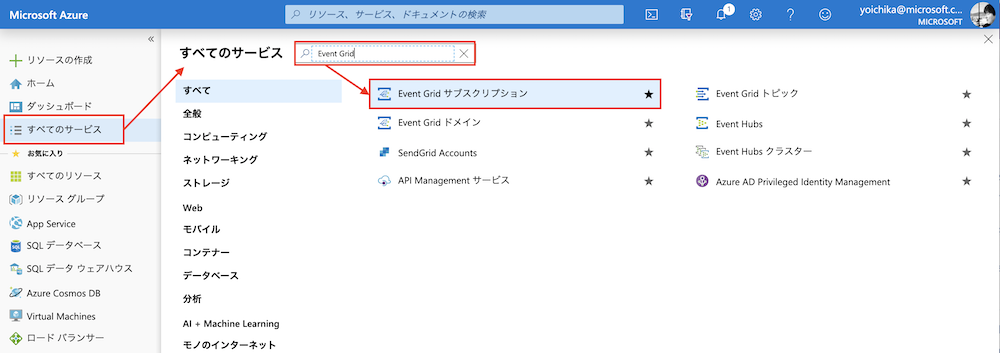
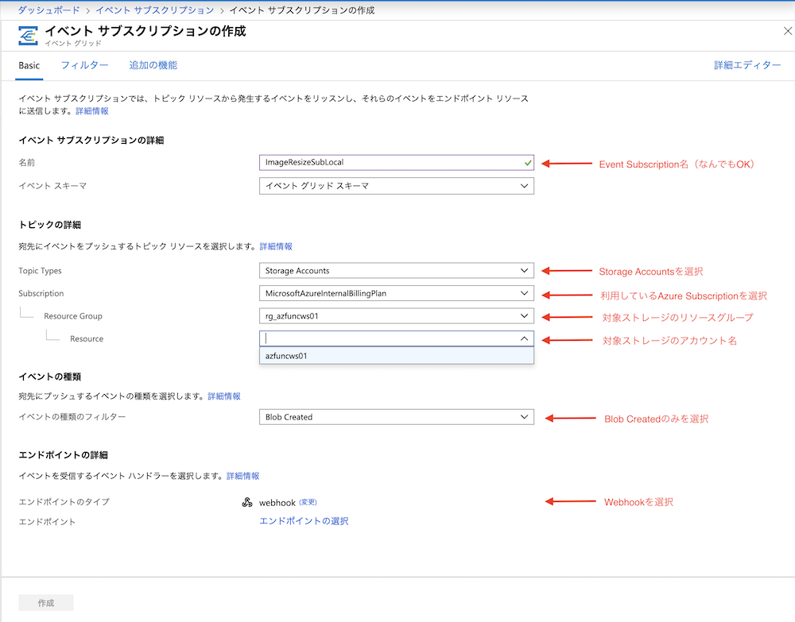
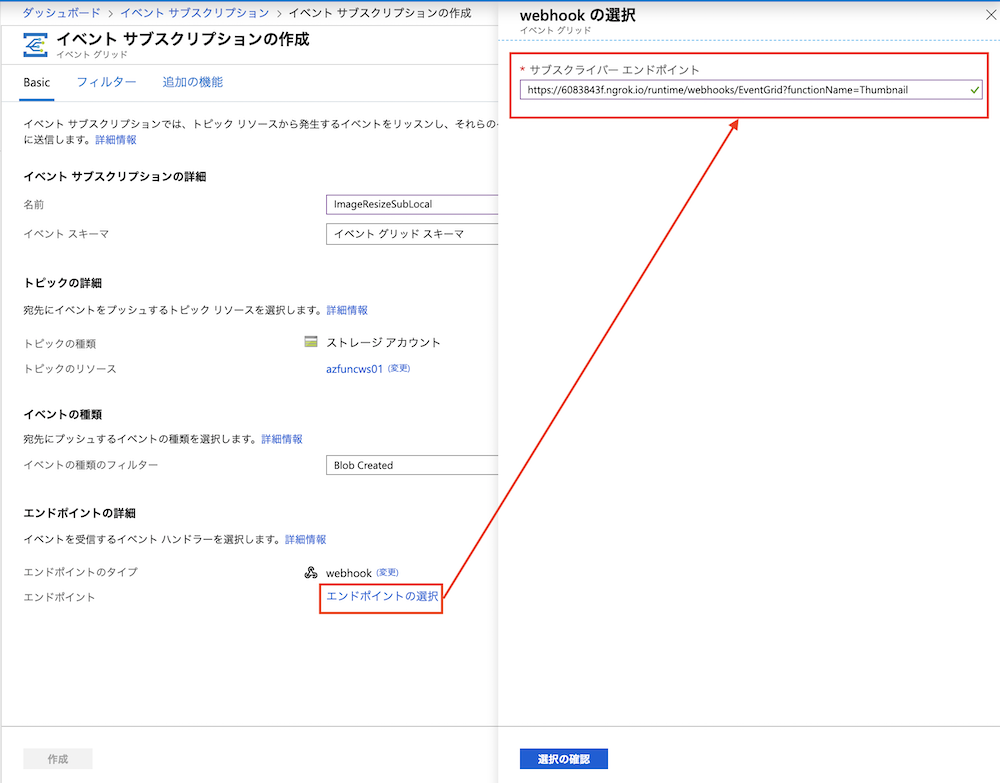
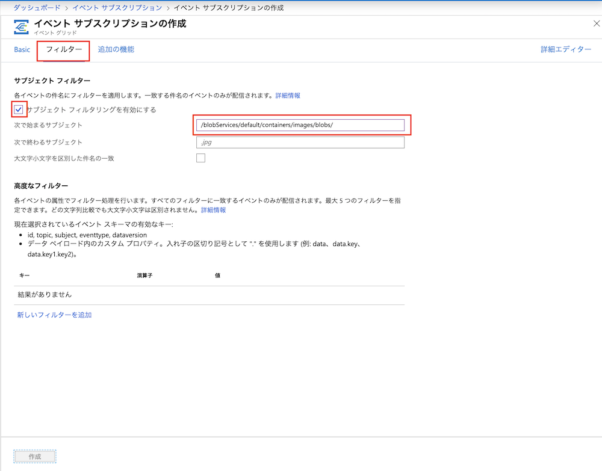
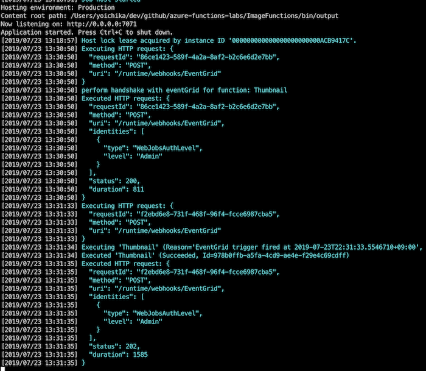
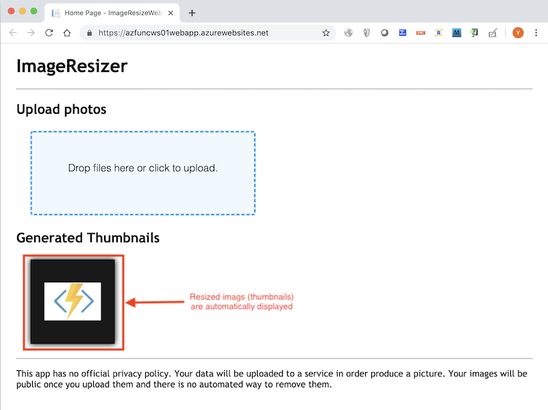
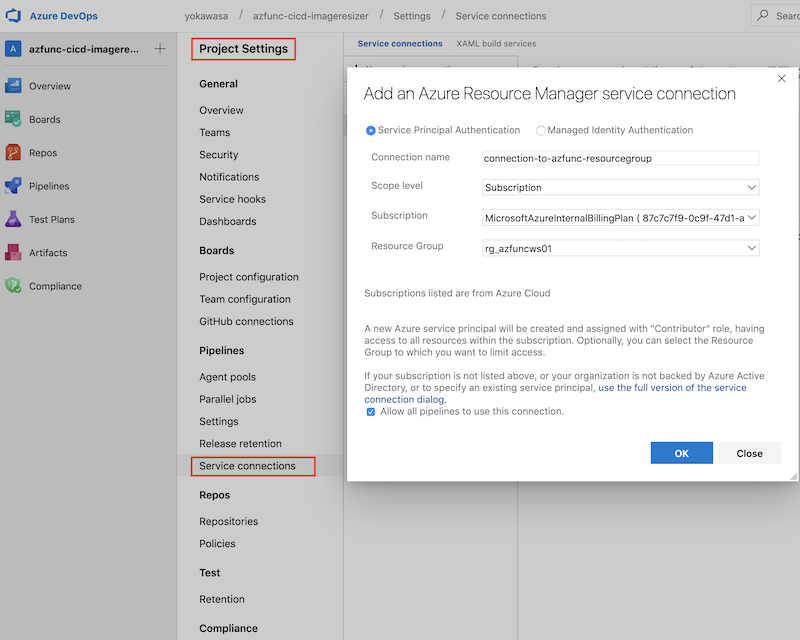
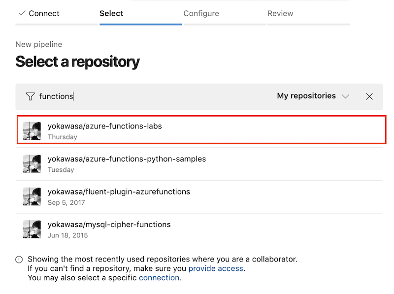
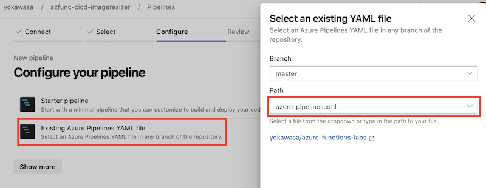
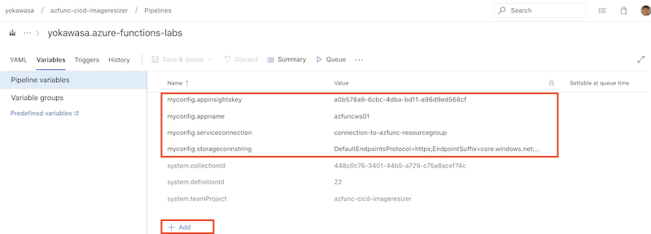

# Azure Functions Hands-on Lab
This repository contains Azure Functions Hands-on materials in Japanese.

**Japanese Version** - これは日本語コンテンツです

<!-- TOC -->

- [Azure Functions Hands-on Lab](#azure-functions-hands-on-lab)
    - [0. サンプルアプリアーキテクチャ](#0-サンプルアプリアーキテクチャ)
    - [1. 準備](#1-準備)
        - [1-1. ソフトウェアのインストール](#1-1-ソフトウェアのインストール)
            - [Azure CLI (>=2.0.14)](#azure-cli-2014)
            - [.NET Core SDK](#net-core-sdk)
            - [Azure Functions Core Tools (Ver 2.x)](#azure-functions-core-tools-ver-2x)
            - [Visual Studio Codeとその拡張 (optional)](#visual-studio-codeとその拡張-optional)
        - [1-2. Azureサブスクリプションの選択](#1-2-azureサブスクリプションの選択)
        - [1-3. Azureリソースの作成](#1-3-azureリソースの作成)
            - [リソースグループの作成](#リソースグループの作成)
            - [ストレージアカウントとコンテナの作成](#ストレージアカウントとコンテナの作成)
            - [Azure Functionsアカウントの作成](#azure-functionsアカウントの作成)
    - [2. クイックスタート](#2-クイックスタート)
        - [2-1. Azure Functions Core toolsを利用したローカル開発とデプロイメント](#2-1-azure-functions-core-toolsを利用したローカル開発とデプロイメント)
            - [テンプレート一覧を表示](#テンプレート一覧を表示)
            - [Functionsアプリの新規作成](#functionsアプリの新規作成)
            - [Functionの新規追加 (Http Trigger Function)](#functionの新規追加-http-trigger-function)
            - [Functionsアプリの起動](#functionsアプリの起動)
            - [アクセステスト](#アクセステスト)
        - [2-2. VS Codeを使ったローカル開発+デプロイメント (optional)](#2-2-vs-codeを使ったローカル開発デプロイメント-optional)
    - [3. 画像リサイズアプリのローカル開発とデプロイメント](#3-画像リサイズアプリのローカル開発とデプロイメント)
        - [2-1. ソースコード取得](#2-1-ソースコード取得)
        - [2-2. Functionsアプリのローカル実行とテスト](#2-2-functionsアプリのローカル実行とテスト)
            - [ngrokのインストールと実行](#ngrokのインストールと実行)
            - [Functionsアプリのローカル実行](#functionsアプリのローカル実行)
            - [Event Gridサブスクリプションの設定（ローカルテスト用）](#event-gridサブスクリプションの設定ローカルテスト用)
            - [Event Grid Trigger Functionのローカルテスト](#event-grid-trigger-functionのローカルテスト)
            - [Event Gridサブスクリプションを削除](#event-gridサブスクリプションを削除)
        - [2-3. FunctionsのAzureへのデプロイメントとテスト](#2-3-functionsのazureへのデプロイメントとテスト)
            - [Functionsのデプロイメント](#functionsのデプロイメント)
            - [アプリケーション設定のアップデート](#アプリケーション設定のアップデート)
            - [Event Gridサブスクリプションの設定](#event-gridサブスクリプションの設定)
            - [Event Grid Trigger Functionのテスト](#event-grid-trigger-functionのテスト)
        - [2-4. App insightsとの連携設定 (Optional)](#2-4-app-insightsとの連携設定-optional)
        - [2-5. フロント用Webアプリのデプロイメント](#2-5-フロント用webアプリのデプロイメント)
            - [App Serviceプランの作成](#app-serviceプランの作成)
            - [Web Appの作成](#web-appの作成)
            - [Web Appアプリのデプロイ](#web-appアプリのデプロイ)
            - [アクセステスト](#アクセステスト-1)
    - [4. CI/CD](#4-cicd)
        - [4-1. Azure Pipelinesの準備](#4-1-azure-pipelinesの準備)
            - [Azure DevOps Organizationの用意](#azure-devops-organizationの用意)
            - [Githubアカウント](#githubアカウント)
            - [コード取得](#コード取得)
        - [4-2. Service Connectionsの設定](#4-2-service-connectionsの設定)
        - [4-3. azure-pipelinesを利用したCI/CDの設定](#4-3-azure-pipelinesを利用したcicdの設定)
            - [Pipelineの作成](#pipelineの作成)
            - [Pipelineの実行](#pipelineの実行)
    - [5. Cleanup](#5-cleanup)
    - [References](#references)

<!-- /TOC -->


## 0. サンプルアプリアーキテクチャ


## 1. 準備

### 1-1. ソフトウェアのインストール

#### Azure CLI (>=2.0.14)

Azure CLI `2.0.14もしくはそれ以上`のバージョンをインストールしてください。詳しくは[Azure CLIのインストール](https://docs.microsoft.com/ja-jp/cli/azure/install-azure-cli?view=azure-cli-latest)を参照ください。

#### .NET Core SDK

- Windowsの場合: [NET Core 2.x SDK for Windows](https://www.microsoft.com/net/download/windows) をインストールしてください
- Macの場合: [NET Core 2.x SDK for Windows](https://www.microsoft.com/net/download/macos) をインストールしてください

#### Azure Functions Core Tools (Ver 2.x)

Azure Functionsのラインタイムを含み、ローカル開発・テストで必要となります。Azure Functions Core Toolsバージョン2をインストールください。手順については[Azure Functions Core Tools のインストール](https://docs.microsoft.com/ja-jp/azure/azure-functions/functions-run-local#v2)を参照ください。

#### Visual Studio Codeとその拡張 (optional)

Visual Studio Code (以下VS Code)をインストールした後、VS Code market placeよりAzure Functions extensionをインストールしてください。
- [VS Coce](https://azure.microsoft.com/ja-jp/products/visual-studio-code/)
- [Azure Function extension for VS Code](https://marketplace.visualstudio.com/items?itemName=ms-azuretools.vscode-azurefunctions)

### 1-2. Azureサブスクリプションの選択

Azure CLI コマンドを使用する前に、`az login`でサインインする必要があります。
```bash
az login
```
Azure CLI で既定のブラウザーを開くことができる場合、開いたブラウザにサインイン ページが読み込まれます。 それ以外の場合は、ブラウザーページを開いて、お使いのブラウザーで[https://aka.ms/devicelogin](https://aka.ms/devicelogin)に移動した後、コマンド ラインの指示に従って認証コードを入力します。 最後に、 ブラウザーでアカウントの資格情報を使用してサインインします。

ログイン完了後に、次のコマンドを実行してAzureサブスクリプション一覧を表示します。

```
az account list -o table
```
> 出力結果
```
Name                             CloudName    SubscriptionId                        State    IsDefault
-------------------------------  -----------  ------------------------------------  -------  -----------
Visual Studio Premium with MSDN  AzureCloud   xxxxxxxxxx-xxxx-xxxx-xxxx-xxxxxxxxxx  Enabled  True
Another sub1                     AzureCloud   xxxxxxxxxx-xxxx-xxxx-xxxx-xxxxxxxxxx  Enabled  False
Another sub2                     AzureCloud   xxxxxxxxxx-xxxx-xxxx-xxxx-xxxxxxxxxx  Enabled  False
Another sub3                     AzureCloud   xxxxxxxxxx-xxxx-xxxx-xxxx-xxxxxxxxxx  Enabled  False
```

もし、複数のサブスクリプションを持っている場合は、次のように利用したいサブスクリプション名をデフォルトに設定ください

```bash
# az account set -s 'サブスクリプション名'
az account set -s 'Visual Studio Premium with MSDN'
```

### 1-3. Azureリソースの作成

Azure CLIコマンドを使ってAzure Functionsサービスアカウントを作成するために必要なリソースを作成します。

#### リソースグループの作成
まずは、Azureリソースグループを作成してください。基本的に、このハンズオンで作成するAzureリソースにはこのリソースグループ名を指定します。

```bash
# 変数値の設定
export RESOURCE_GROUP="リソースグループ名"   #ex. rg_azfuncws01
export REGION="リージョン名"                #ex. japaneast

# リソースグループの作成
az group create --name $RESOURCE_GROUP --location $REGION
```

#### ストレージアカウントとコンテナの作成
続いて、ハンズオンのサンプルアプリケーションで使用するストレージアカウントとストレージコンテナを作成してください。

```bash
# 変数値の設定
export STORAGE_ACCOUNT_NAME="ストレージアカウント名"

# ストレージアカウントの作成
az storage account create \
  --name $STORAGE_ACCOUNT_NAME \
  --location $REGION \
  --resource-group $RESOURCE_GROUP \
  --sku Standard_LRS \
  --kind StorageV2

# ストレージアクセスキーの取得
ACCESS_KEY=$(az storage account keys list \
--account-name $STORAGE_ACCOUNT_NAME \
--resource-group $RESOURCE_GROUP --output tsv |head -1 | awk '{print $3}')

# imagesコンテナの作成
az storage container create  \
    --name "images" \
    --account-name $STORAGE_ACCOUNT_NAME \
    --account-key $ACCESS_KEY \
    --public-access off

# thumbnailsコンテナの作成 
# アクセス権限: 一般アクセス可能 (public accessible)
az storage container create  \
    --name "thumbnails" \
    --account-name $STORAGE_ACCOUNT_NAME \
    --account-key $ACCESS_KEY \
    --public-access container
```
>  [NOTE] このハンズオンではBlobストレージのイベントを使用します。Blobストレージのイベントは`General Purpose V2`タイプのストレージで利用可能です。 詳しくは、[こちら](https://docs.microsoft.com/ja-jp/azure/storage/blobs/storage-blob-event-quickstart#create-a-storage-account)のページを参照ください。

#### Azure Functionsアカウントの作成

ストレージアカウント作成後、次の手順でAzure Functionsアカウントを作成してください。

```bash
# 変数値の設定
export AZFUNC_APP_NAME="Azure Functionsアカウント名"

# Azure Functionsアカウントの作成
# プラン: Consumption Plan
# ラインタイム: dotnet
az functionapp create \
  --resource-group $RESOURCE_GROUP \
  --name $AZFUNC_APP_NAME \
  --storage-account $STORAGE_ACCOUNT_NAME \
  --consumption-plan-location $REGION \
  --runtime dotnet
```

## 2. クイックスタート

### 2-1. Azure Functions Core toolsを利用したローカル開発とデプロイメント

このセクションはAzure Functions Core toolsを使ってコードのローカル実行とデプロイメントを実施します。


#### テンプレート一覧を表示

次のコマンドで利用可能なテンプレート一覧を表示します。
```bash
func templates list
```
<details><summary>出力結果</summary>
<p>

```
C# Templates:
  Azure Blob Storage trigger
  Azure Cosmos DB trigger
  Durable Functions activity
  Durable Functions HTTP starter
  Durable Functions orchestrator
  Azure Event Grid trigger
  Azure Event Hub trigger
  HTTP trigger
  IoT Hub (Event Hub)
  Outlook message webhook creator
  Outlook message webhook deleter
  Outlook message webhook handler
  Outlook message webhook refresher
  Microsoft Graph profile photo API
  Azure Queue Storage trigger
  SendGrid
  Azure Service Bus Queue trigger
  Azure Service Bus Topic trigger
  Timer trigger
...
```

</p>
</details>

#### Functionsアプリの新規作成

次のコマンドでAzure Functionsアプリプロジェクトを新規作成します。名前は`testFunctions`、ランタイムが`.NET Core`のプロジェクトを作成します。
```bash
func init TestFunctions --worker-runtime dotnet
```

これによりプロジェクト用ディレクトリ`TestFunctions`が作成されます。

#### Functionの新規追加 (Http Trigger Function)

次に、このプロジェクトルートディレクトリに移動して、下記コマンドで`testfunc`という名前のHttpTrigger functionを新規作成する。

```bash
# プロジェクトルートディレクトリに移動
cd TestFunctions

# テンプレートを元にHTTP Trigger functionの新規作成
func new --language dotnet \
    --template "HTTP trigger" --name testfunc
```

最終的に次のようなファイル・ディレクトリが作成されます。
```
tree TestFunctions

TestFunctions
├── TestFunctions.csproj    # dotnetプロジェクトの構成ファイルのリストとシステムアセンブリなどへの参照など 
├── host.json               # Functions Appのすべての関数に影響するグローバル構成設定ファイル
├── local.settings.json     # ローカル設定ファイル (Functions AppサービスのApp Settingsにあたる)
└── testfunc.cs             # Functions(testfunc)のコード
```
> [NOTE]
> - [host.jsonリファレンス](https://docs.microsoft.com/ja-jp/azure/azure-functions/functions-host-json)
> - [local.settings.jsonリファレンス](https://docs.microsoft.com/en-us/azure/azure-functions/functions-run-local#local-settings-file)

>  **testfunc.cs**
```csharp
using System;
using System.IO;
using System.Threading.Tasks;
using Microsoft.AspNetCore.Mvc;
using Microsoft.Azure.WebJobs;
using Microsoft.Azure.WebJobs.Extensions.Http;
using Microsoft.AspNetCore.Http;
using Microsoft.Extensions.Logging;
using Newtonsoft.Json;

namespace TestFunctions
{
    public static class testfunc
    {
        [FunctionName("testfunc")]
        public static async Task<IActionResult> Run(
            [HttpTrigger(AuthorizationLevel.Function, "get", "post", Route = null)] HttpRequest req,
            ILogger log)
        {
            log.LogInformation("C# HTTP trigger function processed a request.");

            string name = req.Query["name"];

            string requestBody = await new StreamReader(req.Body).ReadToEndAsync();
            dynamic data = JsonConvert.DeserializeObject(requestBody);
            name = name ?? data?.name;

            return name != null
                ? (ActionResult)new OkObjectResult($"Hello, {name}")
                : new BadRequestObjectResult("Please pass a name on the query string or in the request body");
        }
    }
}
```

#### Functionsアプリの起動

続いて、プロジェクトルートディレクトリ配下で次のコマンドでFunctionsをローカル起動します。依存するライブラリは自動的にインストールされます。

```bash
func host start
```
<details><summary>出力結果</summary>
<p>

```
.NET Core 向け Microsoft (R) Build Engine バージョン 15.9.20+g88f5fadfbe
Copyright (C) Microsoft Corporation.All rights reserved.

  /Users/yoichika/dev/github/azure-functions-labs/TestFunctions/TestFunctions.csproj のパッケージを復元しています...
  MSBuild ファイル /Users/yoichika/dev/github/azure-functions-labs/TestFunctions/obj/TestFunctions.csproj.nuget.g.props を生成しています。
  MSBuild ファイル /Users/yoichika/dev/github/azure-functions-labs/TestFunctions/obj/TestFunctions.csproj.nuget.g.targets を生成しています。
  /Users/yoichika/dev/github/azure-functions-labs/TestFunctions/TestFunctions.csproj の復元が 1.17 sec で完了しました。
  TestFunctions -> /Users/yoichika/dev/github/azure-functions-labs/TestFunctions/bin/output/bin/TestFunctions.dll

ビルドに成功しました。
    0 個の警告
    0 エラー

経過時間 00:00:04.96

                  %%%%%%
                 %%%%%%
            @   %%%%%%    @
          @@   %%%%%%      @@
       @@@    %%%%%%%%%%%    @@@
     @@      %%%%%%%%%%        @@
       @@         %%%%       @@
         @@      %%%       @@
           @@    %%      @@
                %%
                %

Azure Functions Core Tools (2.7.1480 Commit hash: 8c6876cebeeca3dd6a1b895bd0e21acba4af8053)
Function Runtime Version: 2.0.12555.0
Windows Setting AzureWebJobsStorage =
.NET Setting FUNCTIONS_WORKER_RUNTIME = dotnet
.NET Setting WEBSITE_HOSTNAME = localhost:7071
.NET Setting AzureWebJobsScriptRoot = /Users/yoichika/dev/github/azure-functions-labs/t/TestFunctions/bin/output
.NET Setting AZURE_FUNCTIONS_ENVIRONMENT = Development

...途中省略...

Hosting environment: Production
Content root path: /Users/yoichika/dev/github/azure-functions-labs/t/TestFunctions/bin/output
Now listening on: http://0.0.0.0:7071
Application started. Press Ctrl+C to shut down.

Http Functions:

        testfunc: [GET,POST] http://localhost:7071/api/testfunc
```

</p>
</details>

#### アクセステスト
上記コマンドでローカル起動したFunctionsを停止しない状態で、別のターミナルもしくはブラウザでアクセスすると次のような結果が出力される。

```bash
curl "http://localhost:7071/api/testfunc?name=Azure"
```
> 出力結果
```
Hello, Azure
```

最後に、下記コマンドで作成したFunctionsをAzureにデプロイメントします。デプロイメント先には[1-3. Azureリソースの作成](#1-3-azureリソースの作成)で作成したAzure Functionsアカウント名を指定ください。

```bash
func azure functionapp publish $AZFUNC_APP_NAME
```
<details><summary>出力結果</summary>
<p>

```
.NET Core 向け Microsoft (R) Build Engine バージョン 15.9.20+g88f5fadfbe
Copyright (C) Microsoft Corporation.All rights reserved.

  /Users/yoichika/dev/github/azure-functions-labs/TestFunctions/TestFunctions.csproj の復元が 63.11 ms で完了しました。
  TestFunctions -> /Users/yoichika/dev/github/azure-functions-labs/TestFunctions/bin/publish/bin/TestFunctions.dll

ビルドに成功しました。
    0 個の警告
    0 エラー

経過時間 00:00:02.26

Getting site publishing info...
Creating archive for current directory...
Uploading 3.37 MB [###############################################################################]
Upload completed successfully.
Deployment completed successfully.
Syncing triggers...
Functions in azfuncws01:
    testfunc - [httpTrigger]
        Invoke url: https://azfuncws01.azurewebsites.net/api/testfunc?code=kJtJHdmDdO4e6v98YZa3sVnhYB3rEnrFsjbx8WdrVMeadACwuct9FA==
```

</p>
</details>


上記コマンドの出力結果で最後に表示される`Invoke url`がAzureにデプロイメントされたFunctionのエンドポイントになります。このエンドポイントに`&name=Azure`のパラメータを加えてアクセスすると次のようなローカル環境でのテストと同じ結果が得られます。

```bash
curl "https://azfuncws01.azurewebsites.net/api/testfunc?code=kJtJHdmDdO4e6v98YZa3sVnhYB3rEnrFsjbx8WdrVMeadACwuct9FA==&name=Azure"
```
> 出力結果
```
Hello, Azure
```

### 2-2. VS Codeを使ったローカル開発+デプロイメント (optional)

このセクションはオプショナルです。 ここでは、上記2-1と同様の作業をVSCodeを使って行います。

https://code.visualstudio.com/tutorials/functions-extension/getting-started


## 3. 画像リサイズアプリのローカル開発とデプロイメント

このセクションではストレージに保存された画像をEvent Grid Triggerを契機にリサイズ処理を行うFunctionsアプリと、画像アップロードとリサイズされた画像を表示するフロントエンドアプリをデプロイメントします。

FIXME: 処理フローを表す画像

### 2-1. ソースコード取得

Githubレポジトリより本セクションのサンプルFunctionsアプリのソースコードを取得ください。
```bash
git clone https://github.com/yokawasa/azure-functions-labs.git
```
gitコマンドがローカル環境にインストールされてない場合は、直接[こちら](https://github.com/yokawasa/azure-functions-labs/archive/master.zip)よりZIPファイルをダウンロードください。

### 2-2. Functionsアプリのローカル実行とテスト

#### ngrokのインストールと実行

Event GridはAzure内もしくは外で発生したイベントをPush型でルーティング機能を提供するPlatoform-as-a-Service（PaaS)です。ここでEvent GridがローカルFunctionsと連携するためにはローカルで起動しているFunctionsにアクセスする設定する必要があります。これを可能にするのが[ngrok](https://ngrok.com/)です。ngrokによりAzure側からローカルマシンで起動しているFunctionsをコールすることができるようになります。

[こちら](https://ngrok.com/)からngrokをダウンロードください。

続いて、下記ngrokコマンドを実行ください。
```
ngrok http -host-header=localhost 7071
```
> 出力結果
```
ngrok by @inconshreveable                                                                                                                                                               (Ctrl+C to quit)

Session Status                online
Session Expires               7 hours, 59 minutes
Update                        update available (version 2.3.34, Ctrl-U to update)
Version                       2.3.29
Region                        United States (us)
Web Interface                 http://127.0.0.1:4040
Forwarding                    http://6083843f.ngrok.io -> http://localhost:7071
Forwarding                    https://6083843f.ngrok.io -> http://localhost:7071

Connections                   ttl     opn     rt1     rt5     p50     p90
                              0       0       0.00    0.00    0.00    0.00
```

これによりlocalhost:7071への外からのアクセス用インターフェース(017ee120.ngrok.io) が発行されました。

ここで利用するサンプルFunction名は`Thumbnail`であるため、実際に外からこのFunctionをコールするためのURLは次のようになります。このURLは[Event Gridサブスクリプションの設定](#event-gridサブスクリプションの設定ローカルテスト用)にて必要になります。

```
https://6083843f.ngrok.io/runtime/webhooks/EventGrid?functionName=Thumbnail
```

Event Grid Functionsのアクセス用URLの詳細については下記NOTEを参照ください。

> [NOTE]
> 次のURLは`localhost:7071`で起動するEventGrid Trigger Function（名前: `nameOfYourFunction`）へのアクセス用エンドポイントになります。
> ```
> http://localhost:7071/runtime/webhooks/EventGrid?functionName=nameOfYourFunction
> ```
> ngrokが提供するアクセス用インターフェースが6083843f.ngrok.ioの場合、下記のURL経由で外からローカルのEventGrid Trigger Functionをコールすることができるようになります。
> ```
> https://6083843f.ngrok.io/runtime/webhooks/EventGrid?functionName=nameOfYourFunction
> ```

#### Functionsアプリのローカル実行

まずは、プロジェクトルートディレクトリに移動してください。
```
cd ImageFunctions
```

続いて、先ほど作成したストレージの接続文字列を取得してください。

```bash
# ストレージの接続文字列を取得
az storage account show-connection-string \
--resource-group $RESOURCE_GROUP --name $STORAGE_ACCOUNT_NAME \
--query connectionString --output tsv
```
> 出力結果
```
DefaultEndpointsProtocol=https;EndpointSuffix=core.windows.net;AccountName=azfuncws01;AccountKey=NowJXRrQK8r15dNsxR215lYwbTXgZOAqz5hFa6mmkQlApw8evPOyfX8udW8t1YVTZKpv1e4oCFmJA1NkL3z9Wx==
```

この文字列を`local.settings.json`の`AzureWebJobsStorage`キーに追加ください。
> local.settings.json
```json
{
  "IsEncrypted": false,
  "Values": {
    "AzureWebJobsStorage": "DefaultEndpointsProtocol=https;EndpointSuffix=core.windows.net;AccountName=azfuncws01;AccountKey=***********************************************==",
    "FUNCTIONS_WORKER_RUNTIME": "dotnet",
    "THUMBNAIL_CONTAINER_NAME": "thumbnails",
    "THUMBNAIL_WIDTH": "100",
    "datatype": "binary"
  }
}
```

`local.settings.json`へのストレージ文字列追加が終わったら、次のコマンドでFunctionsを起動させてください。

```bash
func host start
```
<details><summary>出力結果</summary>
<p>

```
.NET Core 向け Microsoft (R) Build Engine バージョン 15.9.20+g88f5fadfbe
Copyright (C) Microsoft Corporation.All rights reserved.

  /Users/yoichika/dev/github/azure-functions-labs/ImageFunctions/ImageFunctions.csproj の復元が 50.56 ms で完了しました。
  ImageFunctions -> /Users/yoichika/dev/github/azure-functions-labs/ImageFunctions/bin/output/bin/ImageFunctions.dll

ビルドに成功しました。
    0 個の警告                                                                                                                                                                                              0 エラー

経過時間 00:00:02.22


                  %%%%%%
                 %%%%%%
            @   %%%%%%    @
          @@   %%%%%%      @@
       @@@    %%%%%%%%%%%    @@@
     @@      %%%%%%%%%%        @@
       @@         %%%%       @@
         @@      %%%       @@
           @@    %%      @@
                %%
                %

Azure Functions Core Tools (2.7.1480 Commit hash: 8c6876cebeeca3dd6a1b895bd0e21acba4af8053)
Function Runtime Version: 2.0.12555.0
.NET Setting AzureWebJobsStorage = DefaultEndpointsProtocol=https;EndpointSuffix=core.windows.net;AccountName=azfuncws01;AccountKey=NowJXRrQK8r15dNsxR215lYwbTXgZOAqz5hFa6mmkQlApw8evPOyfX8udW8t1YVTZKpv
1e4oCFmJA1NkL3z9Ww==
.NET Setting FUNCTIONS_WORKER_RUNTIME = dotnet
.NET Setting THUMBNAIL_CONTAINER_NAME = thumbnails
.NET Setting THUMBNAIL_WIDTH = 100
.NET Setting datatype = binary
.NET Setting WEBSITE_HOSTNAME = localhost:7071

... 途中省略 ... 

Hosting environment: Production
Content root path: /Users/yoichika/dev/github/azure-functions-labs/ImageFunctions/bin/output
Now listening on: http://0.0.0.0:7071
Application started. Press Ctrl+C to shut down.
[2019/07/23 11:00:06] Host lock lease acquired by instance ID '000000000000000000000000BF147E01'.
```

</p>
</details>

#### Event Gridサブスクリプションの設定（ローカルテスト用）

ここではEvent Gridサブスクリプションの設定を行いEvent Gridが拾う対象イベントとそのイベントのルーティング先(Webhookポスト先エンドポイント)をマッピングします。

Azureポータルで下記イメージのように左側のメニューから「すべてのサービス」を選択いただき、検索フォームにキーワード文字列"`Event Grid`"を入力ください。絞り込まれたアイテム一覧の中にある「`Event Gridサブスクリプション`」をクリックください。



次のように`Event Gridサブスクリプション`を設定していきます。

1. Event Gridサブスクリプションの基本情報を入力します。


2. サブスクライバーエンドポイントには先のステップで取得した外からのコール用のFunctionのURLを指定します。


3. Event Gridサブスクリプションの基本情報の次にフィルターの入力に進みます。ここでは特定のコンテナ(`images`)でのブロブ作成イベントでフィルタリングするように設定します。


**Event Grid サブスクリプションの設定要点**
- name: `ImageResizeSubLocal`
- topic: `Azure Storage (azfuncws01)`
- endpoint: `Webhook`: `https://(YOURDOMAIN).ngrok.io/runtime/webhooks/EventGrid?functionName=Thumbnail`
- filters: 次で始まるサブジェクト: `/blobServices/default/containers/images/blobs/`
> [NOTE] Blob Storageイベントの詳細については[こちら](https://docs.microsoft.com/en-us/azure/storage/blobs/storage-blob-event-quickstart#trigger-an-event-from-blob-storage)を参照ください

#### Event Grid Trigger Functionのローカルテスト

Event Grid サブスクリプションの設定が完了したら、最後にイベント対象のストレージにコンテナに画像をアップロードして、ローカル環境で起動しているFunctionが無事コールされることを確認します。

1. 対象Blobストレージの画像アップロード用コンテナ(`images`)にテスト画像をアップする

2. ローカル環境で起動しているFunctionが無事コールされ下記のようなログが出力されることを確認

3. 最終的にリサイズされた画像がサムネイル格納用コンテナに保存されていることを確認


#### Event Gridサブスクリプションを削除
必要に応じてAzureポータルでローカルテスト用に作成したEventGridサブクリプションを削除してください。

### 2-3. FunctionsのAzureへのデプロイメントとテスト

#### Functionsのデプロイメント
下記コマンドでFunctionsをAzureにデプロイメントします。デプロイメント先には[1-3. Azureリソースの作成](#1-3-azureリソースの作成)で作成したAzure Functionsアカウント名を指定ください。

```bash
# プロジェクトルートディレクトリに移動 (念の為)
cd ImageFunctions

func azure functionapp publish $AZFUNC_APP_NAME
```
<details><summary>出力結果</summary>
<p>

```
.NET Core 向け Microsoft (R) Build Engine バージョン 15.9.20+g88f5fadfbe
Copyright (C) Microsoft Corporation.All rights reserved.

  /Users/yoichika/dev/github/azure-functions-labs/ImageFunctions/ImageFunctions.csproj の復元が 74.73 ms で完了しました。
  ImageFunctions -> /Users/yoichika/dev/github/azure-functions-labs/ImageFunctions/bin/publish/bin/ImageFunctions.dll

ビルドに成功しました。
    0 個の警告
    0 エラー

経過時間 00:00:02.38


Getting site publishing info...
Creating archive for current directory...
Uploading 3.95 MB [###############################################################################]
Upload completed successfully.
Deployment completed successfully.
Syncing triggers...
Functions in azfuncws01:
    Thumbnail - [eventGridTrigger]
```

</p>
</details>

#### アプリケーション設定のアップデート

続いて、Azure Functionsの設定 (App Settings)をアップデートします。

```bash
# ストレージ文字列の取得
STORAGE_CONNECTION_STRING=$(az storage account show-connection-string \
--resource-group $RESOURCE_GROUP --name $STORAGE_ACCOUNT_NAME \
--query connectionString --output tsv)

# Azure Functionsの設定 (App Settings)をアップデート
az webapp config appsettings set \
  -n $AZFUNC_APP_NAME \
  -g $RESOURCE_GROUP \
  --settings \
AzureWebJobsStorage=$STORAGE_CONNECTION_STRING \
THUMBNAIL_CONTAINER_NAME=thumbnails \
THUMBNAIL_WIDTH=100 \
FUNCTIONS_EXTENSION_VERSION=~2
```

#### Event Gridサブスクリプションの設定

AzureポータルのEvent Grid Trigger Functionsのページで「 Event Grid サブスクリプションの追加」をクリックください。

Event Gridサブスクリプション設定については基本的に[Event Gridサブスクリプションの設定（ローカルテスト用）](#event-gridサブスクリプションの設定ローカルテスト用)と変わりません。以下、設定のポイントになります。

**Event Grid サブスクリプションの設定要点**
- name: `ImageResize`
- topic: `Azure Storage (azfuncws01)`
- endpoint: `Webhook`: `自動的に入力済み`
- filters: 次で始まるサブジェクト: `/blobServices/default/containers/images/blobs/`
> [NOTE] Blob Storageイベントの詳細については[こちら](https://docs.microsoft.com/en-us/azure/storage/blobs/storage-blob-event-quickstart#trigger-an-event-from-blob-storage)を参照ください

#### Event Grid Trigger Functionのテスト

Event Grid サブスクリプションの設定完了後、 [Event Grid Trigger Functionのローカルテスト](#event-grid-trigger-functionのローカルテスト)と同様に、イベント対象のストレージにコンテナに画像をアップロードして、無事にリサイズされた画像がサムネイル格納用コンテナに保存されていることを確認してください。

### 2-4. App insightsとの連携設定 (Optional)

[こちらの手順](https://docs.microsoft.com/ja-jp/azure/azure-functions/functions-monitoring#add-to-an-existing-function-app
)の従い、既存のFunctionsアプリに対してApp Insightsとの統合を有効化してください。


### 2-5. フロント用Webアプリのデプロイメント

#### App Serviceプランの作成

```bash
export APP_SERVICE_PLAN_NAME="azfuncws01plan"

az appservice plan create --name $APP_SERVICE_PLAN_NAME \
    --resource-group $RESOURCE_GROUP --sku Free
```

#### Web Appの作成
```bash
export WEBAPP_NAME="azfuncws01webapp"

az webapp create --name $WEBAPP_NAME \
    --resource-group $RESOURCE_GROUP --plan $APP_SERVICE_PLAN_NAME
```

#### Web Appアプリのデプロイ
```bash
# Web Appにアプリケーションをデプロイ
az webapp deployment source config --name $WEBAPP_NAME \
  --resource-group $RESOURCE_GROUP --branch master --manual-integration \
  --repo-url https://github.com/Azure-Samples/storage-blob-upload-from-webapp

# ストレージキー文字列の取得
STORAGE_KEY=$(az storage account keys list --account-name $STORAGE_ACCOUNT_NAME --resource-group $RESOURCE_GROUP --output tsv |head -1 | awk '{print $3}')

# Webappのアプリ設定を更新
az webapp config appsettings set \
--name $WEBAPP_NAME --resource-group $RESOURCE_GROUP \
--settings AzureStorageConfig__AccountName=$STORAGE_ACCOUNT_NAME \
AzureStorageConfig__ImageContainer=images \
AzureStorageConfig__ThumbnailContainer=thumbnails \
AzureStorageConfig__AccountKey=$STORAGE_KEY
```

#### アクセステスト
作成したWeb Appににブラウザでアクセスしてください。サンプル画像をアップロードして無事に画面下部にサムネイルが表示されたら成功です。
```bash
open https://$WEBAPP_NAME.azurewebsites.net/
```




## 4. CI/CD

このセクションでは[Azure Pipelines](https://azure.microsoft.com/ja-jp/services/devops/pipelines/)を利用したビルドとデプロイの自動化を設定します。

### 4-1. Azure Pipelinesの準備

#### Azure DevOps Organizationの用意
Azure DevOps Organizationが必要になります（無料）。もしAzure DevOps Organizationをお持ちでない場合は次の手順に従いAzure DevOpsへのサインイン/サインアップを行いOrganizationを作成してください。
- [Quickstart: Sign up, sign in to Azure DevOps](https://docs.microsoft.com/ja-jp/azure/devops/user-guide/sign-up-invite-teammates?view=azure-devops)
- [Quickstart: Create an organization or project collection](https://docs.microsoft.com/ja-jp/azure/devops/organizations/accounts/create-organization?toc=%2Fazure%2Fdevops%2Fget-started%2Ftoc.json&bc=%2Fazure%2Fdevops%2Fget-started%2Fbreadcrumb%2Ftoc.json&view=azure-devops)

#### Githubアカウント
コードレポジトリを作成可能なGithubアカウントが必要になります（無料）。もしまだお持ちでない場合は[こちら](https://github.com)より作成してください。

#### コード取得
本セッションで作成するパイプラインではデプロイ対象のサンプルアプリとして下記レポジトリのアプリを使用します。ご自分のGithubアカウントで下記レポジトリをForkしてください。

```
https://github.com/yokawasa/azure-functions-labs
```

### 4-2. Service Connectionsの設定
Azure DevOpsにサインインして、ブラウザで今回ご利用のAzure DevOps Organizationのダッシュボードを表示させてください。
- https://dev.azure.com/{your-organization-name}

続いて画面右上の`Create Project`ボタンをおして、 新しいプロジェクトを作成してください。設定パラメータはデフォルトのままで問題ありません。


続いてダッシュボードの画面左下にある`Project settings`を選択ください。設定ページで次の流れで`Azure Resource Manager`を選択ください。
> `Select Pipelines` > `Service connections` > `New service connection` > ` Azure Resource Manager`

すると、ダイアログボックス`Add an Azure Resource Manager service connection`が表示されます。 次のように各パラメータの入力を行ってください。
- **Connection Name**: 　任意のService Connection名を入力ください（後の設定で名前が必要になるのでメモください）
- **Scope Level**: Subscriptionを選択ください
- **Subscription**:  本デプロイメント用のApp Servicesアカウントを作成したいサブスクリプションを選択ください。ここではすでにFunctions用のApp Servicesアカウントを作成しているのでそのサブスクリプションを選択ください。
- **Resource Group**: パイプラインからのアクセス許可を与えるAzureのリソースグループ名をお選びください。ここではすでにFunctions用のApp Servicesアカウントを作成したリソースグループを選択ください。
- **Allow all pipelines to use this connection**をチェックしてください。



### 4-3. azure-pipelinesを利用したCI/CDの設定

#### Pipelineの作成
1. Azure DevOps Organizationにサインインして先ほど作成したプロジェクトを開いてください
2. 左メニューの`Pipelines`をクリックして`New Build Pipeline`を選択ください
3. コードレポジトリに`Github`を選択して、先のステップにてForkしていただいたレポジトリ（`azure-functions-labs`）を選択ください。
    
4. `Existing Azure Pipelines YAML file`を選択いただき、レポジトリ中のPipeline YAMLファイルパスを入力ください。ここではルート配下の`azure-pipelines.xml`になります。
    
5. `Review your pipeline YAML`ページで、前ステップで選択いただいたYAMLファイルが表示されます。各種パラメータが変数形式で記述していますが、まずは`Run`を実行ください。Pipelineが失敗します。
6. 再び上記で作成したPipelineを選択して選択して`Edit`ボタンで編集ページに進めてください。そこで下記のように`Variables`を選択いただきPipelineの変数設定ページに進めてください。
    
7. Pipelineの変数設定ページにて`Add`ボタンを押して下記４つのPipeline変数を設定ください。
    
    - `myconfig.serviceconnection`: 4-2で設定したService Connectionsの名前
    - `myconfig.appname`: デプロイ先のAzure Functions App名
    - `myconfig.storageconnstring`: Azure Functionsが利用するAzureストレージの接続文字列 
    - `$(myconfig.appinsightskey`: App Insightsのキー

#### Pipelineの実行
Pipeline設定後にPipelineを実行してください。Pipelineの処理が開始され次のようなページに遷移します。最終的にAzure Functionsのデプロイメントが成功することを確認ください。失敗した場合はService Connectionsの設定、もしくはPipeline変数の内容に問題がある可能性があります。
  

最終的にAzureポータル、もしくはFunctionsを動かしてレポジトリ上のAzure FunctionsコードがAzureにデプロイメントされたことを確認してください。

## 5. Cleanup

本ハンズオンで作成したリソースを削除してください。
```bash
az group delete --name $RESOURCE_GROUP
```

## References
- [Azure Functions Documentation](https://docs.microsoft.com/en-us/azure/azure-functions/)
- [Microsoft Learn (Azure Functions)](https://docs.microsoft.com/en-us/learn/browse/?term=Azure%20Functions)
- [Azure Function Event Grid Trigger Local Debugging](https://docs.microsoft.com/en-us/azure/azure-functions/functions-debug-event-grid-trigger-local)
